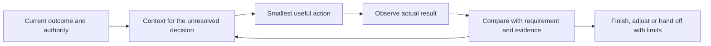

# Project Orchestrator

A skill for agents turning a user's objective into a useful, maintainable and verified product outcome. For substantive work it defaults to authorized subagents, with the main session retaining strategy, user communication, integration and acceptance. Explicit solo choices and small direct edits remain supported, with relevant context, observable tool feedback and recovery from interruptions.

**Unreleased candidate with breaking changes.** The current source accepts policy v2 and measurement records v2; reporter output is v3 and defaults to summary. It retains the read-only artifact verifier. It is not an installed-copy update or a new release. See the [evaluation index](evals/README.md) and [current author review](evals/subagent-default-review.md) for what was checked and what remains unrun.

## How an agent uses it

For a clear, authorized low-risk edit, make the change, run the relevant check and report the actual result. Do not create delegation, policy files or measurement records merely to use the skill.

For consequential work, the [entrypoint](skills/project-orchestrator/SKILL.md) guides a decision loop:



The loop can end with working code, a supported product decision or evidence that changes the next step. It does not require a document at every stage. Quality, authority, truthfulness and data safety remain mandatory; optimize time, resources and maintenance cost within them.

Agents select relevant available skills/plugins within current authority without asking the user for an explicit/Auto preference. User choices and exclusions still apply. A mismatched skill or unavailable tool does not become suitable because it was loaded. Native permissions, installation and external-action authority remain separate from capability selection.

## Read by decision

The nine product-development capabilities remain covered through focused references. Load a reference when its decision matters; leave unrelated guidance outside the working context.

| Decision | Guidance and sufficient output |
| --- | --- |
| Product judgment, requirements and user experience | [Product delivery](skills/project-orchestrator/references/product-delivery.md): supported need, business-rule examples, recoverable journey, smallest step and feedback decision |
| System design | [System design](skills/project-orchestrator/references/system-design.md): clear responsibilities, data/trust boundaries, justified tradeoff and a change/failure check |
| Implementation and diagnosis | [Implementation and diagnosis](skills/project-orchestrator/references/implementation-and-diagnosis.md): usable integrated slice or a discriminating observation, with tool errors and incomplete output identified |
| Verification and quality | [Evidence](skills/project-orchestrator/references/evidence-and-challenge.md): criteria matched to actual artifacts/revisions, with unresolved limits |
| Release and operations | [Product operations](skills/project-orchestrator/references/product-operations.md): authorized release/stop decision, checked recovery and observation owner |
| Coordination and learning | [Handoffs](skills/project-orchestrator/references/handoffs.md) and [improvement](skills/project-orchestrator/references/improvement.md): current ownership/context, bounded repairs and a justified reusable correction |

Use the canonical [execution-mode rules](skills/project-orchestrator/references/policy.md#execution-mode-and-lead-responsibility): substantive work uses subagents without another mode question once authority, configuration, budget and runtime are sufficient. Honor an existing solo/session choice or user-granted discretion. Ask before switching to an independent session or having the main session implement everything if the choice is not already covered. Missing prerequisites call for clarification, not silent solo fallback.

Keep coupled work with one execution owner, which can be a worker; the main session retains overall responsibility. Different files or specialties alone do not establish independent work. Identify stable inputs, expected output, shared resources and the integration owner. One worker is sufficient when appropriate; concurrency and extra management roles are not required.

Without an explicit user model choice, [worker allocation](skills/project-orchestrator/references/policy.md#capability-choice-and-adaptive-allocation) prefers allowed, available Luna/Spark models. Resolve exact IDs and override/context behavior from the actual runtime. Effort remains adaptive, starting from a permitted observed default; Luna/Spark are not effort levels. Main-session settings remain user-owned. Neither the preference nor this workflow grants budget or amends a project policy.

The [fictional examples](skills/project-orchestrator/references/worked-examples.md) clarify direct edits, explicit solo work, default subagents, an independent-session choice, diagnosis and a changing assignment. They are optional illustrations, not measured agent outcomes.

## Context, communication and recovery

Keep requirements in the existing product record, continuity in one current checkpoint when needed, and proof in versioned artifacts. Preserve consequential decisions, rejected hypotheses, current authority and open acceptance through handoffs or compaction. Retrieve source sections and raw results on demand. Neither full chat history nor optional measurement streams need to be loaded at startup.

A current authorized user decision can update a requirement before its document catches up. Communicate material changes to affected owners and establish receipt before dependent work continues. Sending a message, a recipient becoming idle and acceptance are different events. Inspect the final artifact against current requirements and combined caller behavior.

For Codex and Claude Code, match the [actual coordination mechanism](skills/project-orchestrator/references/handoffs.md#match-the-observed-runtime) before relying on it. A fork can inherit author reasoning; it is not automatically independent review. A worktree does not isolate databases, ports, outputs or all Git state. A stopped turn may leave a process running. Before takeover or replay, reconcile writer/process identity, revision and whether side effects already occurred. Late results retain their old owner/attempt/revision and cannot overwrite current work automatically.

After two failed repairs of the same issue, diagnose again before another repair or stop with a useful handoff. New IDs, a new session or greater effort do not reset that history. Use supported event waits instead of repeated status polling or messages with no new information.

## Breaking contracts and optional tools

| Interface | Current behavior |
| --- | --- |
| Policy | v2: project identity, confirmation, nullable delegation and budget. Worker selection requires configured delegation and a confirmed budget stance. Removed `mainSession` and `permissions` fields are rejected. |
| Capability selection | Automatic selection from appropriate available capabilities within authority; no per-objective explicit/Auto confirmation. |
| Measurements | v2 events remain optional. v1 records now reject the report instead of being counted and excluded. |
| Reporter | v3 output; summary is default, detail is paginated, full audit requires `--view full`. No `legacyCounts`, `viewVersion` or legacy `build` helper. |
| Artifact verifier | Existing read-only manifest/hash/path checks and CLI retained. |

No compatibility shim or automatic migration is included. Unsupported project files keep their confirmed authority meaning; a checker rejection is not permission to ignore limits. Replace policy only at an authorized adoption boundary. These breaking changes do not authorize breaking a product's contracts or changing an installed project.

Configuration is not mandatory for separately authorized solo work. When a durable policy is needed, use the [policy v2 contract](skills/project-orchestrator/references/policy.md#policy-v2); the packaged template is intentionally unconfirmed.

```sh
# Validate a configured policy; this does not authorize dispatch.
python -B skills/project-orchestrator/scripts/check_policy.py --policy /project/docs/orchestration/policy.json
# Check an actual new/changed worker selection against observed runtime.
python -B skills/project-orchestrator/scripts/check_policy.py --policy /project/docs/orchestration/policy.json --project-id example-project --model model-a --effort medium --runtime /temporary/runtime.json
```

When a measurement question exists, query recorded observations. Unknown measurements stay unknown; no telemetry or automatic event collection is required.

```sh
python -B skills/project-orchestrator/scripts/report_workflow.py --metrics /project/metrics.jsonl --improvements /project/improvements.jsonl --task-id TASK-ID
python -B skills/project-orchestrator/scripts/report_workflow.py --metrics /project/metrics.jsonl --improvements /project/improvements.jsonl --view detail --limit 20
python -B skills/project-orchestrator/scripts/report_workflow.py --metrics /project/metrics.jsonl --improvements /project/improvements.jsonl --view full
```

Only detail accepts `--cursor` and `--limit`; full rejects filters. All input is validated before filtering. The [records reference](skills/project-orchestrator/references/records.md) owns accounting, nulls and cursor behavior.

For a frozen local artifact:

```sh
python -B skills/project-orchestrator/scripts/verify_artifact.py --root /path/to/candidate --manifest /path/to/manifest.json
```

Exit 0 means declared hashes match, 1 means missing/mismatched declared files, and 2 means invalid manifest/root/path input. Hash agreement establishes identity only. No helper grants consent, proves runtime freshness or accepts a product.

## Evidence and limits

The [evaluation index](evals/README.md) separates executable tool tests, author decision reviews, prepared execution packets, historical trials and manifests by revision. The current [worker packets](evals/subagent-default/worker-packets.md) and [assessor rubric](evals/subagent-default/assessor.md) are physically separate and **prepared, not executed**. Future authorized runs stage only required worker material, not the whole repository.

Independent review remains required for persisted-data/security/shared-contract changes, difficult recovery, contradictory evidence and project-defined risks. Explicit solo work can deliver a self-checked candidate or authorized PR while required review and acceptance remain open. Technical verification, independent review, release and observed user value are distinct; PR Draft/non-draft status cannot establish any of them.

The historical neutral comparison found functional correctness in both runs and more work/tokens in the skill run; it did not establish an overall advantage. Current behavioral effectiveness on Codex and Claude Code has not been independently measured. Research, package tests and author walkthroughs are not that evidence.

## Install and maintain deliberately

Installed copies are distributions. A source contribution, PR or merge does not authorize updating them. For an authorized installation from a reviewed local source:

```sh
npx skills add /path/to/project-orchestrator --skill project-orchestrator
```

These commands select the **historical v0.1.0 release**, which uses the older contracts, rather than this candidate:

```sh
npx skills add https://github.com/Quang-Dong/project-orchestrator/tree/v0.1.0 --skill project-orchestrator --agent codex --copy
# Global installation must be explicitly chosen because it affects other projects.
npx skills add https://github.com/Quang-Dong/project-orchestrator/tree/v0.1.0 --skill project-orchestrator --agent codex --copy -g
```

Verify the selected tag/commit and its corresponding [historical manifest](evals/skill-manifest-v0.1.0.json). Adopt a breaking candidate only with separately authorized policy/client changes; no automatic conversion or installed-copy edit occurs. Returning to a verified source does not undo project data changes. See [maintenance](skills/project-orchestrator/references/maintenance.md).

## Contribute and verify

Follow [CONTRIBUTING](CONTRIBUTING.md). Keep public fixtures fictional and export only reviewed source-relative evidence. Preserve historical reports/manifests. Source files, project records, installed copies and evaluation workspaces have separate owners and purposes.

Run the available platform skill validator and the repository checks:

```sh
python -B -m compileall -q skills evals
python -B -m unittest discover -s evals -p "test_*.py"
```

CI runs the Python 3.14 package checks, including policy v2, reporter v3 and artifact-verifier tests. Also verify JSON, relative links/anchors, whitespace and public-content scope on the final source. No dependency, orchestration engine, scheduler, automatic permission change, global update or product telemetry is included.
