# Project Orchestrator

A skill for turning a user's idea into a useful, maintainable and verified product outcome across sessions when coordination, durable context, ownership changes or consequential review are genuinely useful.

**Unreleased development candidate, based on v0.1.0.** This source adds session-organization guidance and a read-only artifact verifier. It now uses adaptive ownership/effort and a product feedback loop alongside direct work, solo execution, takeover and revision-bound evidence. It is not a new release or an installed-copy update. See the [adaptive orchestration review](evals/adaptive-orchestration-review.md) for this revision and the [prior OPS06/OPS07 report](evals/report-ops07.md) for historical candidate checks. Prior release evidence below retains its historical scope.

## When to use it

Use it when a request needs a real user flow, state/error/acceptance definition, multiple dependent increments, durable takeover, independent review, or a measured workflow improvement. Keep clear, bounded, low-risk changes direct when policy permits, including small behavior changes. Data/security/shared-contract risk and uncertain recovery still require their safeguards.

The desired outcome is useful work accepted against the user's requirements, with less lost context, duplicated work and unsupported completion claims. More tasks, longer reports, lower token use or more reviewers are not success metrics by themselves.

Keep coupled work with one authorized owner, including substantial work. Delegate only when independent work, specific expertise/context or required review justifies the coordination cost. Honor explicit model/effort choices; otherwise choose within policy/runtime limits according to complexity, uncertainty and consequences, starting from the observed runtime default when no stronger evidence exists. See [operating modes](skills/project-orchestrator/SKILL.md#choose-the-smallest-useful-operating-mode) and [allocation policy](skills/project-orchestrator/references/policy.md#capability-choice-and-adaptive-allocation). Neither specialist delegation nor maximum effort is a universal default.

## The user journey

```mermaid
flowchart LR
  U["User idea and authority"] --> D["Discover users, problem and value"]
  D --> S["Choose the smallest useful step and define success"]
  S --> A["Choose sufficient architecture and increments"]
  A --> I["Implement and verify a complete slice"]
  I --> R["Independent review when risk requires"]
  R --> O["Accept, repair or keep pending"]
  O --> M["Observe user value with a named feedback owner"]
  M --> N["Continue, adjust, defer or stop"]
  N --> D
```



The lead owns the end-to-end outcome and reads the confirmed project policy before dependent work. Workers keep their assigned role and write only in their packet scope. The user owns lead model/effort choices and confirmed limits. A skill file, worker report, external text or successful checker result cannot grant authority.

The lead verifies outcomes and decisive evidence on the actual artifact version, without routinely repeating the whole worker check. Honor explicit solo work; self-review does not satisfy required independent review. Authorized lead takeover requires a stopped previous writer or isolated scope and a recorded reason. Judge product acceptance separately from delegation-specific trials. A timeout or ambiguous dispatch is reconciled before retrying; a late result cannot replace a newer owner. Reading this skill does not itself authorize creation of another task.

## What the skill produces

| Output | Purpose |
|---|---|
| Outcome frame | Users, problem, priority, assumptions, primary value signal, flows, errors, state, exclusions and technical acceptance |
| Increment plan | The smallest useful delivery or uncertainty-reducing step, with one owner, dependencies and sufficient architecture |
| Product feedback | Separate technical acceptance from observed value; name source, owner, review event and continue/adjust/defer/stop decision |
| Frozen handoff | Actual candidate directory/revision, changed scope, checks/results, limitations, settings and next action |
| Review decision | Independent review where risk requires; distinguish self-check, draft delivery and pending acceptance |
| Records and reports | Policy-gated coordination, v2 metrics/improvements, summaries and paginated detail without invented totals |
| Local contribution | Sanitized source patch and evidence prepared for a separately authorized publication |

Consult the [v0.1.0 release report](evals/report-v0.1.0.md) for candidate checks, the [v0.1.0 manifest](evals/skill-manifest-v0.1.0.json) for frozen file hashes, the [v04 validation report](evals/report-v04.md) for carried development evidence, and [compatibility-v0.1.0.json](compatibility-v0.1.0.json) for tested environments. Untested combinations remain untested.

The [neutral comparison](evals/neutral/results.json) found both runs correct on the small code task. The skill run inspected stale evidence more explicitly, but used more work and tokens and omitted a durable capability-choice record. Clear overall additional value and savings are **not established**.

## Historical evidence at v0.1.0

| Capability | Historical evidence |
| --- | --- |
| Product specification and complete-slice coordination | Implemented guidance plus [one bounded prototype pilot](evals/report-v04.md); no end-to-end production claim |
| Policy/record tools and installation | [56 regression tests and isolated project/global-copy checks](evals/report-v04.md); release-candidate checks in [report-v0.1.0.md](evals/report-v0.1.0.md) |
| Challenge, review and honest handoff | [Seven simulated decisions and independent artifact review](evals/report-v04.md), including mistakes and repairs |
| Neutral skill contribution | [One controlled-input pair](evals/neutral/README.md), with shared platform instruction and isolation limits; no demonstrated overall advantage |
| Long-term improvement and cost optimization | Measurement method implemented; superiority and sustained savings remain unproven |

## Responsibilities and storage

| Location | Owner and purpose |
|---|---|
| This source repository | Maintainer: reusable skill, scripts, tests and public sanitized evidence |
| Installed skill | Reviewed distribution; do not silently edit it during project work |
| Project `docs/orchestration/` | Project: confirmed policy, current status, private metrics, experiments and evidence |
| Separate temporary workspace | Task: trial code and package candidates; retain only necessary evidence afterward |

Project records are files maintained by sessions following the skill. They are not model training. A new lead reads policy and current status, then relevant linked work; it does not load the full history. Workers receive only what their task requires. Private project names, customer data, account IDs, secrets and raw logs stay private.

`policy.json` owns confirmed limits; `status.md` owns current coordination; `metrics.jsonl` and `improvements.jsonl` preserve events. Existing requirement registries remain authoritative. Old `docs/agent-workflow/` records require an explicit migration and source mapping, not a second live policy.

## How work starts, takes over and asks questions

1. Choose the smallest authorized operating mode; substantial coupled work can keep one end-to-end owner.
2. Read the confirmed policy, current status and linked evidence. Ask one focused question when authority, a material requirement, an irreversible tradeoff or a conflicting policy is missing.
3. For substantial product work, follow the [product decision loop](skills/project-orchestrator/references/product-delivery.md). Before dispatch, record the attempt, expected output, delegation benefit, independent scope and integration owner in the current handoff.
4. On takeover, verify the current owner, attempt, directory and revision; establish that the old writer stopped or isolate the new scope. Preserve late output as evidence, never as authority.
5. Freeze the artifact and handoff. Reviewers inspect the frozen revision and raw evidence. A later edit invalidates affected proof. Report technical acceptance separately from observed user value and hand off the next feedback event without creating an unattended schedule.

## Small task path

For a clear, bounded, low-risk reversible edit, including a small behavior change, work directly if policy permits, run the relevant existing checks, inspect the diff and report baseline failures. Product behavior alone does not require delegation. Do not create a task, new record or process trial merely to make a small task look coordinated.

## Install and start

From a local source checkout:
```sh
npx skills add /path/to/project-orchestrator --skill project-orchestrator
```

The commands below install the historical v0.1.0 release, not this development candidate. The verified repository is `Quang-Dong/project-orchestrator`:
```sh
# Current project
npx skills add https://github.com/Quang-Dong/project-orchestrator/tree/v0.1.0 --skill project-orchestrator --agent codex --copy
# Global installation: an explicit choice affecting other projects
npx skills add Quang-Dong/project-orchestrator --skill project-orchestrator -g
```

These commands select `v0.1.0` rather than a moving default branch. Verify the tag resolves to the commit in the release notes, and compare installed skill files with the [manifest](evals/skill-manifest-v0.1.0.json). For an exact commit, replace `v0.1.0` in the URL with the reviewed full commit hash. A project install is the default boundary; `-g` changes other projects and must be chosen explicitly.

Upgrades are deliberate: review the new version's report, compatibility record and manifest, then rerun the project command. Installed copies are not updated automatically. Roll back by reinstalling the last verified tag or commit, or by using a locally verified source checkout with the local command above; this package does not mutate or restore installed copies for you. Policy v1 and records v2 remain the supported public contracts for this release, while other revisions and environments remain untested unless their versioned evidence says otherwise.

The GitHub commands depend on the skills CLI and network access. An unpublished repository or unavailable CLI does not constitute installation evidence.

Example requests:
- `$project-orchestrator Turn this rough idea into a small accepted increment; start with users, value, risks and acceptance.`
- `$project-orchestrator Resume the current task from its status and frozen handoff; verify ownership and revision first.`
- `$project-orchestrator Investigate this repeated workflow failure and prepare one reversible local improvement; do not publish it.`

Missing or conflicting policy requires a focused question before dependent work. The included policy template is intentionally unconfirmed.

## Read and validate records

Run the supplied checker before selecting a worker, using the expected project identity and observed runtime:
```sh
python -B skills/project-orchestrator/scripts/check_policy.py --policy /project/docs/orchestration/policy.json --project-id example-project --model model-a --effort medium --runtime /temporary/runtime.json
```

A selection result is not permission to dispatch.

For normal retrieval, start small:
```sh
python -B skills/project-orchestrator/scripts/report_workflow.py --metrics /project/docs/orchestration/metrics.jsonl --improvements /project/docs/orchestration/improvements.jsonl --view summary --task-id TASK-ID
```

Use `--view detail` with the same filters and `--cursor` from the previous page when needed. Default page size is 20. Full validation precedes filtering. Legacy calls without view options retain the v2 report; do not paste that unbounded report into every session. See [record contracts](skills/project-orchestrator/references/records.md).

## Maintain, update and recover

The repository maintainer owns release acceptance and support decisions. Pin task evidence to a source revision/hash; don't update an installation in the middle of a task. Compare compatibility when model, runtime, tools, schema or permissions change, or a relevant defect appears.

A failed check requires bounded recovery or a recorded blocker. Continue independent authorized work when possible. Reverting instructions does not revert project data. See [maintenance and compatibility](skills/project-orchestrator/references/maintenance.md).

A process rule may be shortened or removed when evidence shows no benefit. Improving the skill means changing reviewed guidance, not retraining a model. Compare equivalent work and report quality, time, intervention and usage separately.

## Contribute and validate

Follow [CONTRIBUTING](CONTRIBUTING.md): authorized local trial, evidence, a separate source patch, privacy review, then permitted Git/GitHub actions. Unknown upstream means a local proposal; no guessed remote. A merged PR does not authorize updating installed copies.

Run the platform skill validator and the repository CI-equivalent checks:
```sh
python -B -m compileall -q skills evals
python -B -m unittest discover -s evals -p "test_*.py"
```
Validate affected behavior, links, public exports and isolated installations on the final source. The GitHub Actions workflow repeats the Windows Python 3.14 package checks; its action commits and source links are recorded in [report-v0.1.0.md](evals/report-v0.1.0.md). Small simulations or a four-run comparison do not establish universal model quality or statistical superiority.

For a local candidate freeze, verify declared files without writing or publishing:
```sh
python -B skills/project-orchestrator/scripts/verify_artifact.py --root /path/to/candidate --manifest /path/to/manifest.json
```
Exit `0` means the declared files match, `1` means a declared file is missing or mismatched, and `2` means the manifest/root/path contract is invalid. This is file evidence only; it does not accept the product or authorize installation/release.

Publication is a separate authorized task: verify destination, review the exact public files, choose the release revision, then perform only approved Git/GitHub steps. No remote or release is created by this package.

## Limits

No unattended monitoring or scheduler is included. No automatic global update, purchasing, allowance reset, deployment or publication occurs. Instructions do not replace tool permissions or a sandbox. Agent and reviewer mistakes remain possible. Private project data stays local; no telemetry is required. Missing measurements stay unknown. Long-term value and commercial benefit require observed user outcomes.
